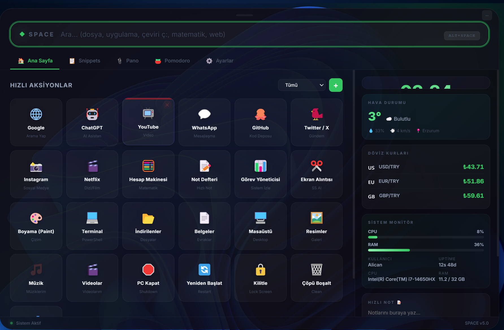
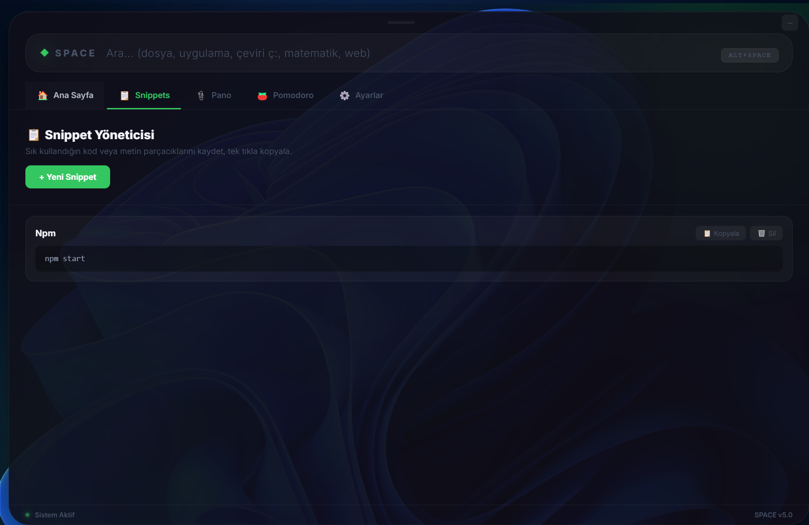

# 🚀 Space Hub - Premium Desktop Launcher

Space Hub is a powerful, modern, and highly customizable desktop launcher built with **Electron**. It provides quick access to files, system commands, and productivity tools, all accessible with a simple **Alt + Space** shortcut.



## ✨ Key Features (Özellikler)

| Feature (Özellik) | Description (Açıklama) | Shortcut / Access |
|---|---|---|
| **⚡ Quick Launch** | Open apps, search files, and run commands instantly. | `Alt + Space` |
| **📁 File Search** | Blazing fast file search powered by PowerShell integration. | Search Bar ("logo.png") |
| **📋 Clipboard History** | Automatically saves your last 50 copied items. | Widget Panel |
| **📝 Snippet Manager** | Save and retrieve code snippets or frequent text blocks. | Snippets Tab |
| **⏱️ Pomodoro Timer** | Built-in focus timer with work/break intervals. | Tools Section |
| **☁️ Weather & 💱 Currency** | Live weather updates and currency exchange rates. | Dashboard Widgets |
| **📊 System Monitor** | Real-time CPU and RAM usage graphs. | Dashboard |
| **⏰ Alarms** | Set reminders and alarms directly from the launcher. | Tools Section |
| **🎨 Themes** | Switch between beautiful themes (Midnight, Ocean, Sunset, etc.). | Settings (Gear Icon) |
| **🌐 Web Shortcuts** | Quick access to Google, ChatGPT, Netflix, and more. | Shortcuts Grid |

---

## 📸 Screenshots (Görseller)

### Dashboard Overview
Access all widgets, shortcuts, and system stats in one glance.


### Search & Results
Find files and folders instantly across your system.


---

## 🛠️ Installation (Kurulum)

### Option 1: Install via Setup (Recommended)
1. Download the latest `SpaceHub Setup.exe` from the Releases page.
2. Run the installer.
3. The app will launch automatically and persist in the system tray.

### Option 2: Run from Source (Developer Mode)
If you want to run the project locally:

1. **Clone the repository:**
   ```bash
   git clone https://github.com/alicantzl/Space-Launcher.git
   cd Space-Launcher
   ```

2. **Install Dependencies:**
   ```bash
   npm install
   ```

3. **Start the Application:**
   * **Use `run.bat` (Recommended for Windows):**
     This script handles environment variables and module conflicts automatically.
     Double-click `run.bat` or run via terminal:
     ```cmd
     .\run.bat
     ```
   * *Do NOT use `npm start` directly as it may cause module resolution issues.*

---

## 🚀 How to Use (Kullanım)

1. **Launch:** Open the app using the desktop shortcut or `run.bat`.
2. **Access:** Press **`Alt + Space`** (or `Super + Space`) to toggle the launcher visibility.
3. **Search:** Start typing to search for apps or files.
4. **Commands:**
   - Type `cmd:taskmgr` to open Task Manager.
   - Type `url:google.com` to open a website.
   - Type `app:calc` to open Calculator.
5. **System Tray:** Use the tray icon (bottom right) to quit or restart the app.

---

## 📦 Build / Packaging

To create a setup file (`.exe`) for distribution:

1. **Close the application** completely.
2. Run the build script:
   ```cmd
   .\build.bat
   ```
3. The installer will be generated in the `dist/` folder.

---

## 🔧 Technical Details
- **Framework:** Electron v28.2.0 (LTS)
- **Language:** JavaScript (CommonJS), HTML5, CSS3 (Glassmorphism)
- **Backend:** Node.js Integration (Search via PowerShell child processes)
- **Storage:** Local JSON files (`userData`)

## 📄 License
MIT License. Free to use and modify.

---
Made with ❤️ by [Alican](https://github.com/alicantzl)
